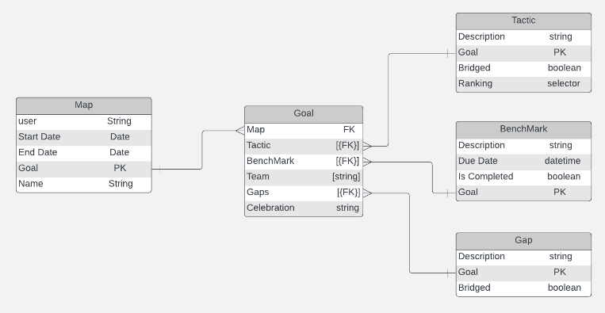
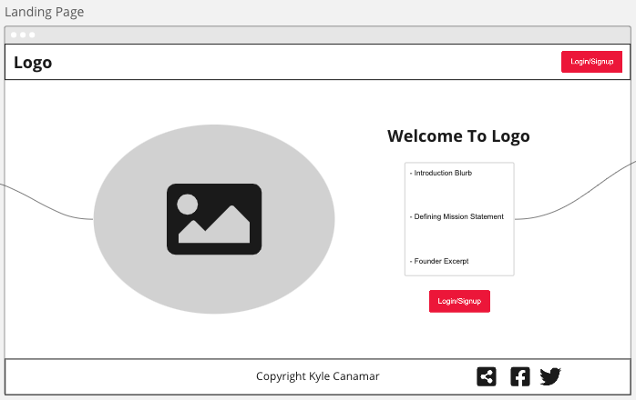
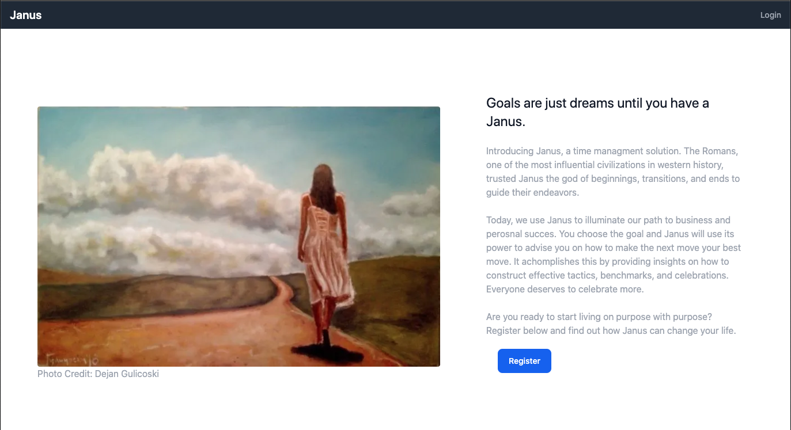

# Product Requirements Documentation

## Technologies Used
| Front End | Backend |
|:------:|:------:|
|Next.js|Sanity.io|
|Tailwind CSS|Magic.link (Oauth)|

**Summary**
| Field | Detail |
|-------|:--------:|
| Project Name | Janus |
| Description | A Time Management Solution |
| Developer | Kyle Canamar |
| Live Website | [Janus](https://capstone-ga.vercel.app/) |
| Repo | [GitHub](https://github.com/kcanamar/capstone-ga) |
| Miro Board| [WireFrames & Planning](https://miro.com/app/board/uXjVOgupON0=/?share_link_id=956899754665)|

## Product Description

Janus is systematic approach to time management that aims the help guide users on a path of excellence. The target market for this product would be a wide range from high school students to senior citizens. The core goal of this project is to remove some of the stress that goes into planning for the future. 

## User Stories

List of stories users should experience when using this application.

- AAU, I can register/login to my own dsahboard
- AAU, I can CRUD a map
- AAU, I can logout

## On the Horizion

- Ablitiy to Add Individual Benchmarks, Tactics, and Gaps
- Statistical readings of users progress 

## ERD

## WireFrame

## Landing Page

